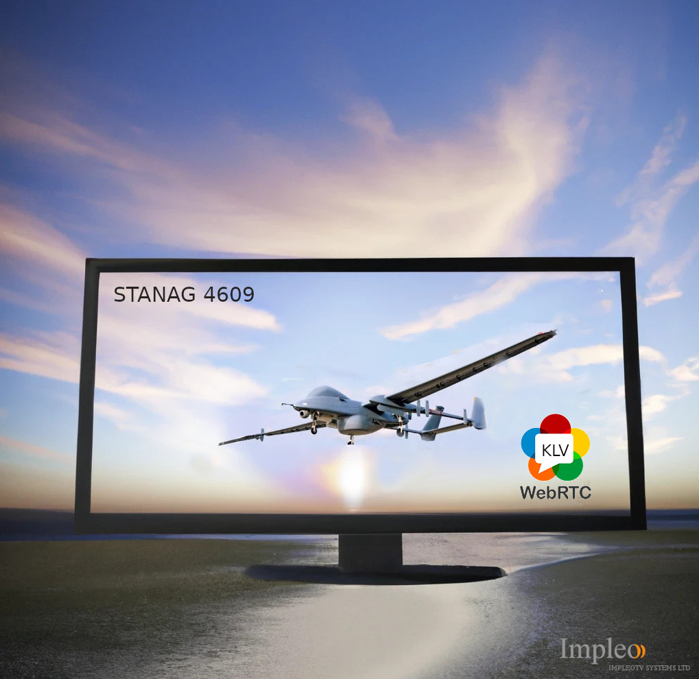

<div align="center">
  <a >
    
  </a>
</div>

# Stanag2WebRTC

**Stanag2WebRTC** allows easy integration of live udp **STANAG 4609** streaming into web-based applications.  
Video and metadata are transcoded on the fly and sent to web clients using **WebRTC** video and data channels. 

<div align="center">
	<font color="blue">Stanag2WebRTC.</font>
</div>



More info on the [Stanag2WebRTC](https://impleotv.com/content/stanag2webrtc/help/index.html)


## Download links


### Linux:

Use **Stanag2WebRTC** docker container. The image will be automatically downloaded.  
```bash
docker run --network host impleo/stanag2webrtc:v1.0.7 -url udp://227.1.1.1:30120
```


### Windows

|          | Version             | Download link                                                           | 
|:---------|:-------------------:|:------------------------------------------------------------------------|
| **Stanag2WebRTC** |  v1.0.7 | [SetupStanag2WebRtc.zip](https://github.com/impleotv/stanag2webrtc-release/releases/latest/download/SetupStanag2WebRtc.zip) | 

> Note. Windows version requires GStreamer demux patch. Without the patch, streams with SYNC KLV will not work.


*Released on Wed, 11 Jan, 18:38 GMT+2*


## License

*No license is needed for application evaluation - it will work in demo mode (with some restrictions).*

**Stanag2WebRtc** is a node-locked software, so you have to get a license (after purchasing the SW) in order to lift demo restrictions. Please install it and fill out an [online form](https://docs.google.com/forms/d/e/1FAIpQLSd_XW6bDsFce1G1cpds4gMQNlwNax0CvkWzcMbscxZ5rLaIbA/viewform), providing the ***Node Info*** string (IMPORTANT!!!) for the target machine.  
You can obtain the **nodeinfo** string at the top of the client demo app.

You'll get back a **license** file and a **key**.

## System Requirements

OS: Linux 64bit / Windows 10 64 bit.

